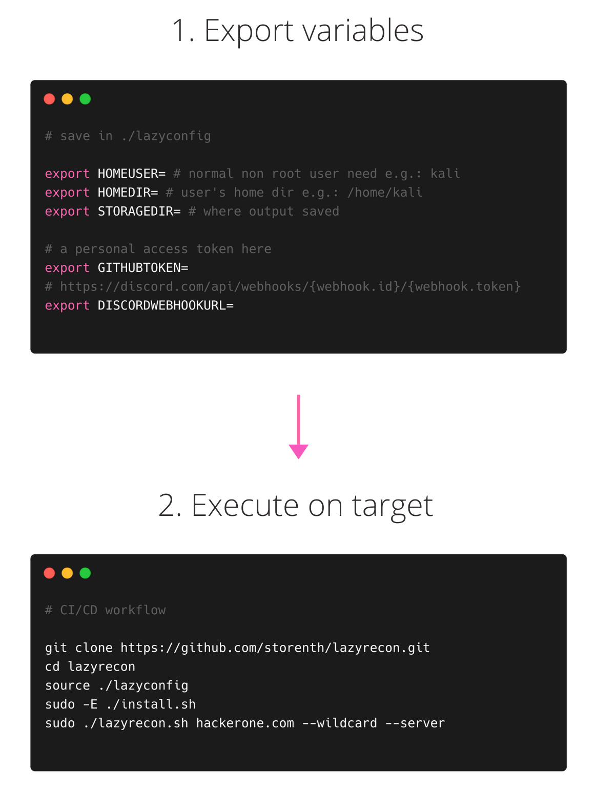

```
  _
 | | __ _ ____ _   _ _ __ ___  ___  ___  _ __
 | |/ _  |_  /| | | |  __/ _ \/ __|/ _ \|  _ \
 | | (_|  / / | | | | | |  __/ (__  (_) | | | 
 |_|\__ _|___/ \__  |_|  \___|\___|\___/|_| |_v2
               |___/
```

<p align="center">
<a href="https://twitter.com/storenth"></a>
<a href="https://www.blackhat.com/us-21/arsenal/schedule/#lazyrecon-v-24051"></a>
<a href="https://discord.gg/fR2QVrWBTq"></a>
</p>

Lazyrecon is a subdomain discovery tool that finds and resolves valid subdomains then performs SSRF/LFI/SQLi fuzzing, brute-force and port scanning. It has a simple modular architecture and is optimized for speed while working with github and wayback machine.

# Features
- Super fast asynchronous execution
- CI/CD ready
- HTML/pdf reports
- Discord integration
- Background listen server
- Domain name, list of domains, IP, CIDR input - notations support
- Teardown and program exit housekeeping
## Workflow
<h3 align="center">
  </a>
</h3>

# About

This script is intended to automate your reconnaissance process in an organized fashion by performing the following:

- Creates a dated folder with recon notes for a target
- Grabs subdomains using `subfinder`, `assetfinder`, `gau`, `waybackurls`, `github-subdomains`
- Additionally finds new subdomains through alterations and permutations using `dnsgen`
- Searches subnets and new assets using math `Mode`
- Filters out live subdomains from a list of hosts using `puredns`
- Checks 1-200,8000-10000 for http(s) probes using `httpx`
- Gets visual part using `headless chromium`
- Performs `masscan` on live servers
- Scanns for known paths and CVEs using `nuclei`
- Shots for [SSRF](https://www.hackerone.com/blog-How-To-Server-Side-Request-Forgery-SSRF)/[LFI](https://www.allysonomalley.com/2021/02/11/burpparamflagger-identifying-possible-ssrf-lfi-insertion-points/)/SQLi based on fetched DOM's and Wayback machine's data
- Checks for 401/403 bypass using [bypass-403](https://github.com/storenth/bypass-403/)
- Performs `ffuf` supercharged by `interlace` using custom WordList based on the [top10000.txt](https://github.com/danielmiessler/RobotsDisallowed/blob/master/top10000.txt)
- Generates report and send it to Discord

The point is to get a list of live IPs (in form of socket addresses), attack available network protocols, check for common CVEs, perform very simple directory bruteforce then use provided reports for manual research.

# Installing
- `Linux` & `Mac` tested
## Prerequirements
```bash
python >= 3.7
pip3 >= 19.0
go >= 1.14
```
### CI/CD way
You can use stateful/stateless build agent (worker). There is no additional time is required for provisioning.
It may look tricky cause masscan/nmap/naabu root user required.
1. Fill in these required environment variables inside: `./lazyconfig`:
```bash
export HOMEUSER= # your normal, non root user: e.g.: kali
export HOMEDIR= # user's home dir e.g.: /home/kali
export STORAGEDIR= # where output saved, e.g.: ${HOMEDIR}/lazytargets
export GITHUBTOKEN=XXXXXXXXXXXXXXXXXX # a personal access token here
export DISCORDWEBHOOKURL= # https://discord.com/api/webhooks/{webhook.id}/{webhook.token}
export GOPATH=$HOMEDIR/go
export PATH=$PATH:/usr/local/go/bin:$GOPATH/bin:$GOROOT/bin:$HOME/.local/bin:$HOME/go/bin:$HOMEDIR/go/bin
export GO111MODULE=on
```
2. Enable new environment `source ./lazyconfig`
3. Call `sudo -E ./install.sh`
4. Execute `sudo -E ./lazyrecon.sh "hackerone.com"`

### Github Actions way
Customize `.github/workflows/test-recon-action.yaml` using `DISCORDWEBHOOKURL` and `GITHUBTOKEN` [secrets](https://docs.github.com/en/actions/reference/encrypted-secrets), enable `--discord` to receive a report:
```yaml
  - name: Install & Recon
    env:
      GO111MODULE: on
      DISCORDWEBHOOKURL: ${{ secrets.DISCORDWEBHOOKURL }}
      GITHUBTOKEN: ${{ secrets.GITHUBTOKEN }}
    run: |
      export HOMEDIR=$HOME
      export HOMEUSER=$RUNNER_USER
      export STORAGEDIR="${HOMEDIR}"/lazytargets
      sudo -E ./install.sh
      sudo -E ./lazyrecon.sh "hackerone.com" --quiet --discord
```
### Hard way
Config your environment variables and dependencies using [INSTALL.MD](https://github.com/storenth/lazyrecon/blob/ci-cd-feature/INSTALL.md)


If you faced with some issues, feel free to join [Discord](https://discord.gg/fR2QVrWBTq), open PR or file the bug.

# Testing
You can check if the dependencies are installed correctly on your machine by running the following tests:
```bash
./test/test_nuclei_templates.sh "./test/nuclei_templates_list.txt"
./test/test_install.sh "./test/dependencies_list.txt"
```

# Usage
Execute with `sudo` because of `masscan`:
```bash
▶ sudo -E ./lazyrecon.sh tesla.com --wildcard
```

| **Parameter**  | **Description**                                       | **Example**                                     |
| ---------------|-------------------------------------------------------|-------------------------------------------------|
| --wildcard     | Subdomains reconnaissance '*.tesla.com' (default)     | ./lazyrecon.sh tesla.com --wildcard             |
| --single       | One target instance 'tesla.com'                       | ./lazyrecon.sh tesla.com --single               |
| --ip           | Single IP of the target machine                       | ./lazyrecon.sh 192.168.0.1 --single --ip        |
| --list         | List of subdomains to process for                     | ./lazyrecon.sh "./testa.txt" --list             |
| --cidr         | Perform network recon, CIDR notation                  | ./lazyrecon.sh "192.168.0.0/16" --cidr          |
| --mad          | Wayback machine's stuff                               | ./lazyrecon.sh tesla.com --mad                  |
| --fuzz         | SSRF/LFI/SQLi fuzzing                                 | ./lazyrecon.sh tesla.com --mad --fuzz           |
| --alt          | Additionally permutate subdomains (*.tesla.com only)  | ./lazyrecon.sh tesla.com --wildcard --alt       |
| --brute        | Basic directory bruteforce (time sensitive)           | ./lazyrecon.sh tesla.com --single --brute       |
| --discord      | Send notifications to discord                         | ./lazyrecon.sh tesla.com --discord              |
| --quiet        | Enable quiet mode                                     | ./lazyrecon.sh tesla.com --quiet                |


# Methodology
0. Use [dnsperftest](https://github.com/cleanbrowsing/dnsperftest) to know your best resolvers
1. Run `./lazyrecon.sh`
2. Check output reports of chromium, nuclei, masscan, `403-bypass-output.txt` `_listen_server.log`, `lfi-matched-url.txt`
3. Pick the right target for you based on screenshot and ports opened.
4. Use Firefox and Burp to proxy all requests while exploratory testing
5. Try to find file upload vulnerabilities
6. Perform Google, Trello, Atlassian, Github, Bitbucket dorking
7. Check JS sources for credentials, API endpoints
8. Investigate `XHR` requests, fuzz parameters and variables
9. Check exploit-db.com for target-specific CVE based on `nmap`/`masscan` output
10. GET/POST Bruteforce for directories: fuzbo0oM-top10000 --> raft --> target specific
11. Continue bruteforcing using custom Headers (X-Custom-IP-Authorization: 127.0.0.1; X-Original-URL:)
12. Try bypass 401/403 errors using [notable](https://github.com/filedescriptor/Unicode-Mapping-on-Domain-names) methods (`%23`, `/%2e/`, `admin.php%2500.md` etc)
13. Look for XSS [xsscrapy.py](https://github.com/DanMcInerney/xsscrapy) or [XSSTRON](https://github.com/RenwaX23/XSSTRON)

# Origin
This project was inspired by original v1.0 [Ben Sadeghipour](https://github.com/nahamsec/lazyrecon) and aimed to implement some of the best practices like [Mechanizing the Methodology](https://www.youtube.com/watch?v=L_qoz2_Qyhk), [TBHM](https://docs.google.com/presentation/d/1MWWXXRvvesWL8V-GiwGssvg4iDM58_RMeI_SZ65VXwQ), [Subdomain Takeovers](https://www.hackerone.com/blog/Guide-Subdomain-Takeovers), [Request Smuggling](https://portswigger.net/web-security/request-smuggling), [SSRF](https://www.hackerone.com/blog-How-To-Server-Side-Request-Forgery-SSRF), [LFI](https://www.allysonomalley.com/2021/02/11/burpparamflagger-identifying-possible-ssrf-lfi-insertion-points/) and [Bruteforce](https://danielmiessler.com/blog/the-most-interesting-disallowed-directories/) based on [Custom wordlist](https://www.youtube.com/watch?v=W4_QCSIujQ4&t=1237s&ab_channel=Nahamsec).
# Notable articles
1. IDOR: https://www.aon.com/cyber-solutions/aon_cyber_labs/finding-more-idors-tips-and-tricks/?utm_source=newsletter&utm_medium=email&utm_campaign=bug_bytes_110_scope_based_recon_finding_more_idors_how_to_hack_sharepoint&utm_term=2021-02-17
2. SSRF: https://notifybugme.medium.com/finding-ssrf-by-full-automation-7d2680091d68 and https://rez0.blog/hacking/2019/11/29/rce-via-imagetragick.html
3. Enumeration guide: https://sidxparab.gitbook.io/subdomain-enumeration-guide/active-enumeration/dns-bruteforcing

### Notes
 - `aquatone` replaced by [headless chromium async script](https://github.com/storenth/lazyrecon/compare/0a9c4c586ee4...24c35f9cadd0) based on performance
 - `Sublist3r` replaced with `subfinder` based on Twitter [discussion](https://twitter.com/Jhaddix/status/1293118260808843264)
 - `nmap` replaced with `masscan` based on its features and Twitter [duscussion](https://twitter.com/DanielMiessler/status/1286721113343447040), use `helpers/nmap_nse_ifile.sh` by hands using `masscan_output.gnmap` as input
 - `smuggler` forked from its [original](https://github.com/gwen001/pentest-tools/blob/master/smuggler.py) aimed to get lightweight solution included this [PR](https://github.com/gwen001/pentest-tools/pull/10)
 - ~~`grep` `meg`'s output for [Location](https://twitter.com/hunter0x7/status/1293168500672954368) in order to exclude 301/302 status codes~~
 (replaced with `httpx -fc 301,302` approach)
 - ~~`httpx -ip` used without `dnsprobe` based on @pdiscoveryio Twitter [answer](https://twitter.com/pdiscoveryio/status/1338163970557894656)~~
 - `altdns` used based on [Scrutiny on the bug bounty](https://docs.google.com/presentation/d/1PCnjzCeklOeGMoWiE2IUzlRGOBxNp8K5hLQuvBNzrFY/)
 - ~~`massdns` fully replaced with `shuffledns` because of [issue](https://github.com/blechschmidt/massdns/issues/73)~~
 - `shuffledns` replaced with `puredns` based on performance
 - [bounty-targets-data](https://github.com/arkadiyt/bounty-targets-data)
 - local listen server approach replaced with [interactsh](https://github.com/projectdiscovery/interactsh)
 - LFI payload now handled and fully featured by [LFI-Payload-List](https://github.com/storenth/LFI-Payload-List) caused outdated [LFI-Payload-List](https://github.com/emadshanab/LFI-Payload-List)
 - WIP: you can track activity in Projects To Do board


**Acknowledgement:** This code was created for personal use with hosts you able to hack/explore by any of the known bug bounty program. Use it at your own risk.